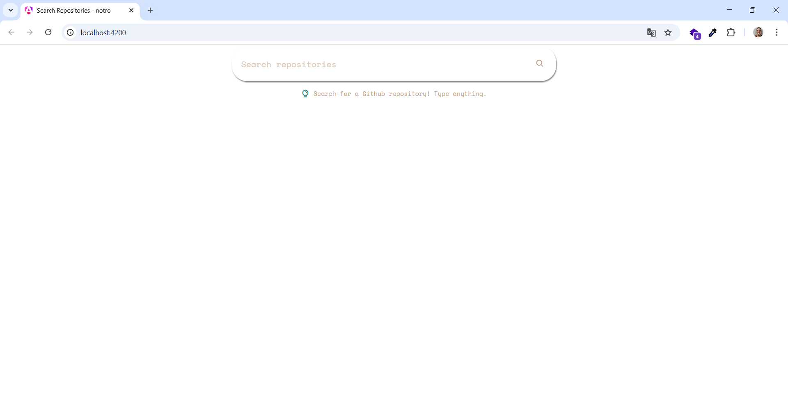
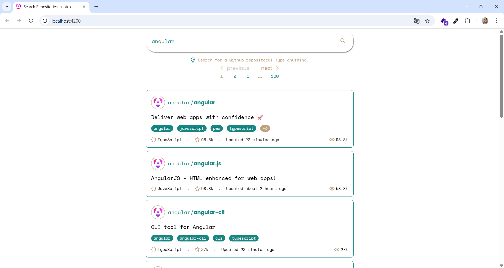
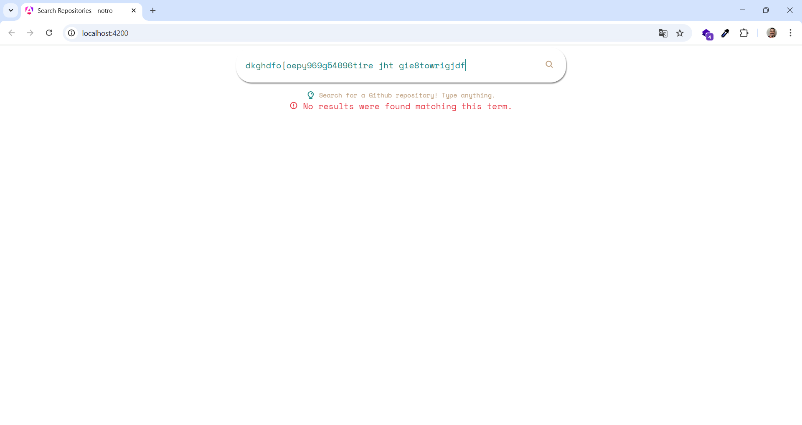
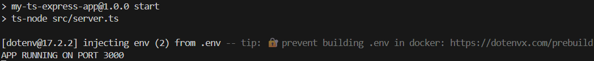
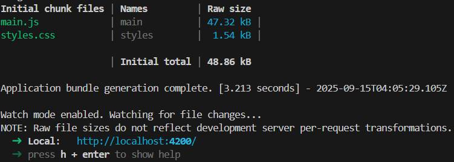

# 🛍️ Desafio Técnico **notro**  

Aplicação fullstack criada com **Angular (v.20)** e **Express.js (v.5) em TypeScript** para buscas de repositórios públicos no GitHub - traz informações referentes ao repositório como descrição, tópicos, linguagem mais utilizada, quantidade de *stars* e *watchers* e última atualização.

<div align="center">
  <details>
    <summary>Imagens da aplicação</summary>
      <div display="flex">
        
        
        
        
      </div>
  </details>
</div>

## ⚠️ Dependências do projeto
Versão do **Node.js**: ```LTS (v22.x)```.<br>
Versão do **Docker** utilizada pra *"conteinerizar"* a aplicação: ```28.4.0```.<br>
Versão do **docker-compose** para definição e a execução de ambos contêineres (frontend e backend) simultaneamente: ```2.39.2```.
 
## 📦 Instalação

### 1. Clone o repositório

```bash
git clone https://github.com/JOAO-LEE/trabalhe-com-a-gente.git
// OU
git clone git@github.com:JOAO-LEE/trabalhe-com-a-gente.git
cd trabalhe-com-a-gente
```

### 2. Rodando a aplicação
<details>
<summary><b>Backend</b></summary>

### 1. Navegue até a pasta

```bash
cd frontend/
```

### 2. Instale as dependências

```bash
npm install
```

### 3. Inicie a aplicação

```bash
npm run dev
```

</details>
<hr>
<details>
<summary><b>Frontend</b></summary>

### 1. Navegue até a pasta

```bash
cd frontend/
```

### 2. Instale as dependências

```bash
npm install
```

### 3. Inicie a aplicação

```bash
ng serve
```
Você deve visualizar no terminal:

</details>
<hr>

### 3. Executando a aplicação com o **Docker** 🐋

Se você estiver na pasta **frontend** ou na pasta **backend**, volte para a pasta raiz da aplicação:

```bash
cd ../
```

Na pasta raiz da aplicação, execute o comando:
```bash
docker-compose up -d
```
Em um navegador, acesse: <br>
**http://localhost:4200**
<hr>

### Respostas

- **Qual ferramentas e bibliotecas (libraries, framework, tools etc) você usou?**
   * No **frontend**
       - **date-fns** - para formatação de data (Última atualização do repositório)
    * No **backend**
       - **camelcase-keys** - A API do Github retorna as informações em *"snake case"*, e para normalizar o nome das variáveis na minha aplicação, utilizei-a para converte-lás para o padrão *"camel case"*.
       - **cors** - para autorizar a origem das requisições da aplicação.
- **Porque você optou pela tecnologia X e não a Y?** 
   * No backend, optei utilizar o **Express.js** por já ter familiaridade com a ferramenta, além de sua fácil configuração; é pouco verbosa e rápida de subir. No frontend eu poderia ter utilizado outros pacotes de formatação de dados, mas escolhi o **date-fns** devido à sua baixa complexidade e robustez; por ser um pacote muito utilizado, existe documentação à respeito da ferramenta e muitas soluções já prontas disponíveis. 
- **Quais princípios da engenharia de software que você usou?**
   - Segui princípios inspirados na arquitetura **MSC (Model Service Controller)**, separando **controllers** e **services** ainda que não houvesse a necessidade de criação da camada de **models** nesse projeto. Essa escolha teve o intuito de separar responsabilidades e manter o código organizado e escalável.
   - Criei funções utilitárias isoladas na pasta `utils`, com o intuito de separar responsabilidades, ter fácil leitura, manutenção e reuso.
- **Desafios e problemas que você enfrentou e como você resolveu?**  
    * Pensar na páginação dos dados foi desafiador. A documentação do Github informa que em uma requisiçào bem sucedida à API, é retornado no *response header* uma chave link com informações de páginação, como os links da próxima página e da última página. Com essas informações, pensei em devolver o link da próxima página para o backend, verficando a página atual. No entanto, pensei que isso não seria tão prático, e isso também não havia resolvido o meu problema de exibição dos números das páginas no frontend. Tendo em vista que a API do Github retornava o número da última página, pensei em renderizar a quantidade de páginas a partir deste número. A criação do código para a exibição de um elipse em uma alta quantidade de páginas foi feita com a ajuda de inteligência artificial.
    * <details><summary>Desenvolvendo no Windows</summary>Enquanto pensava em como fazer a páginação, fazia requisições à API do Github passando os <em>"query params"</em>  que a rota disponibiliza como  <em>"page"</em> e <em>"per_page"</em>, e mesmo passando <em>1</em> em <em>"per_page"</em>, a requisição me devolvia um JSON com quase 3400 linhas. Li e reli a documentação do Github, <a href="https://api.github.com/search/repositories?q=node&per_page=1&page=1">testei diretamente no browser e funcionava normalmente</a> e não entendia o que poderia estar de errado no código. Derrubei e subi a aplicação, testava os <em>"query params"</em>, e ainda não funcionava. Então tive a ideia de comentar trechos do código como o <code>app.ts</code>, e a API continuava funcionando normalmente, retornando os dados do Github. Reiniciei o computador e a aplicação funcionou como deveria, respeitando os <em>"query params"</em>. Pelo que pesquisei, o problema provavelmente era o Windows não ter matado processos antigos do meu computador.
   </details>
- **O que você entende que pode ser melhorado e como fazer isso?**
     - Tendo em vista que a aplicação consome uma API externa, como o GitHub, que já adota rate limit para atender a muitos usuários simultaneamente, entendo que também seria necessário aplicar um mecanismo de limitação de requisições no meu projeto. Sem isso, um único usuário pode gerar sobrecarga ao realizar várias chamadas consecutivas. Uma melhoria seria implementar um middleware de rate limiting, que controlasse o número de requisições permitidas em um intervalo de tempo e retornasse uma mensagem de erro apropriada quando o limite fosse atingido. Como solução paliativa, seria possível bloquear o formulário logo após o envio da requisição e reativá-lo apenas quando a resposta fosse recebida.
